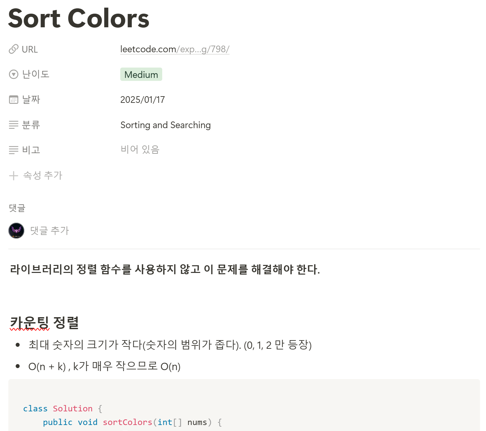
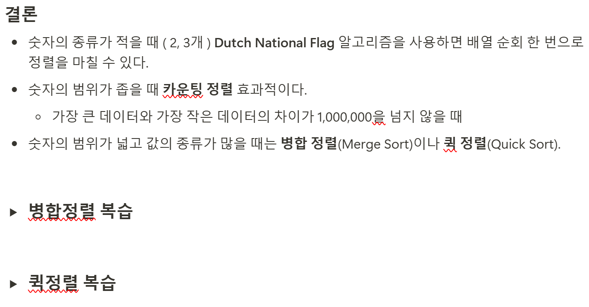
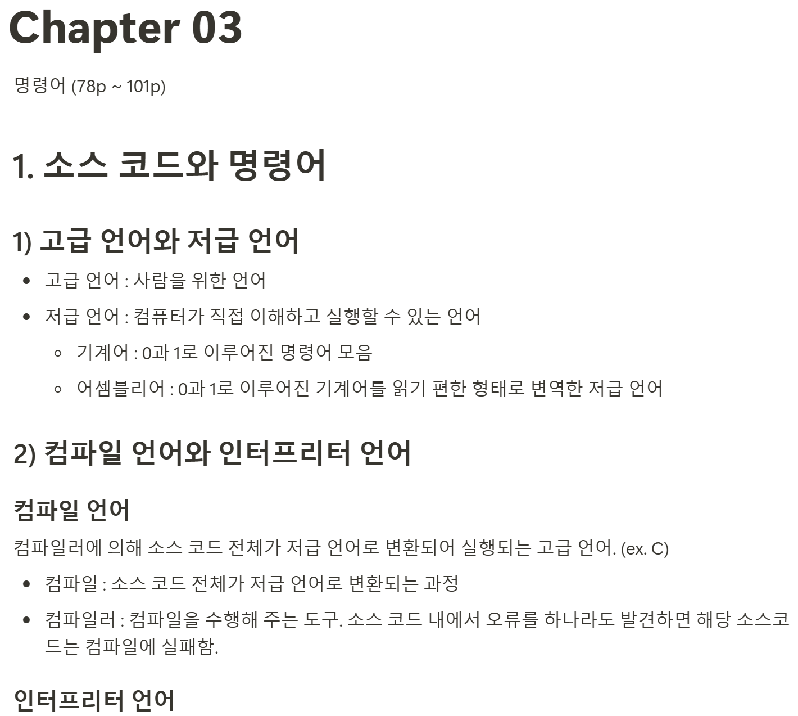
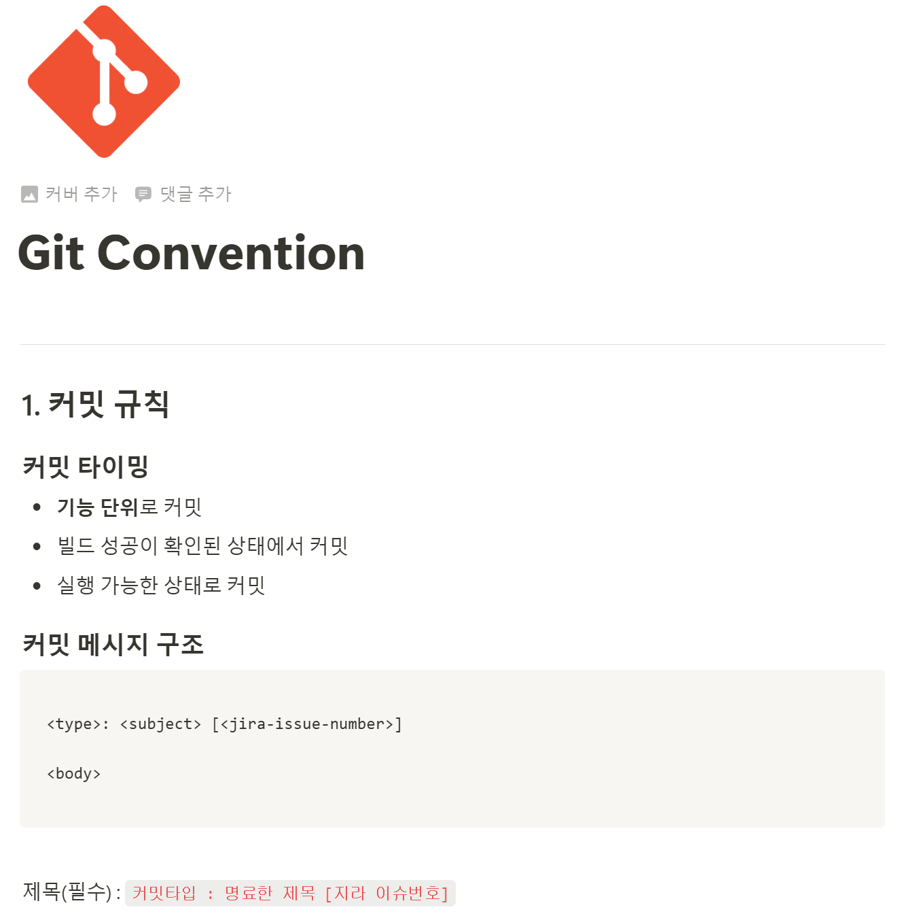

# 스프링부트 & jpa 공부

```java
package jpabook.jpashop.domain;

@Entity
@Table(name = "orders")
@Getter @Setter
@NoArgsConstructor(access = AccessLevel.PROTECTED)
public class Order {
 
	@Id	@GeneratedValue
	@Column(name = "order_id")
	private Long id;
	
	@ManyToOne(fetch = FetchType.LAZY)
	@JoinColumn(name = "member_id")
	private Member member; //주문회원
	
	@OneToMany(mappedBy = "order", cascade = CascadeType.ALL)
	private List<OrderItem> orderItems = new ArrayList<>();
	
	@OneToOne(cascade = CascadeType.ALL, fetch = FetchType.LAZY)
	@JoinColumn(name = "delivery_id")
	private Delivery delivery; //배송정보
	
	private LocalDateTime orderDate; //주문시간
	
	@Enumerated(EnumType.STRING)
	private OrderStatus status; //주문상태 [ORDER, CANCEL]

	//==연관관계 메서드==//
	public void setMember(Member member) {
		this.member = member;
		member.getOrders().add(this);
	}
	
	public void addOrderItem(OrderItem orderItem) {
		orderItems.add(orderItem);
		orderItem.setOrder(this);
	}
	
	public void setDelivery(Delivery delivery) {
		this.delivery = delivery;
		delivery.setOrder(this);
	}
	
	//==생성 메서드==//
	public static Order createOrder(Member member, Delivery delivery,
											 OrderItem... orderItems) {
		Order order = new Order();
		order.setMember(member);
		order.setDelivery(delivery);
		for (OrderItem orderItem : orderItems) {
			order.addOrderItem(orderItem);
		}
		order.setStatus(OrderStatus.ORDER);
		order.setOrderDate(LocalDateTime.now());
		return order;
	}
	
	//==비즈니스 로직==//
	/** 주문 취소 */
	public void cancel() {
		if (delivery.getStatus() == DeliveryStatus.COMP) {
			throw new IllegalStateException("이미 배송완료된 상품은 취소가 불가능합니다.");
		}
		this.setStatus(OrderStatus.CANCEL);
		for (OrderItem orderItem : orderItems) {
			orderItem.cancel();
		}
	}
	
	//==조회 로직==//
	/** 전체 주문 가격 조회 */
	public int getTotalPrice() {
		int totalPrice = 0;
		for (OrderItem orderItem : orderItems) {
			totalPrice += orderItem.getTotalPrice();
		}
		return totalPrice;

	}
}

```

<aside>
‼️ @ManyToOne, @OneToOne 에는 fetch = FetchType.LAZY

- n + 1 의 문제로 성능 저하가 일어날 수 있음
</aside>

---

```java
package jpabook.jpashop.api;

@RestController
@RequiredArgsConstructor
@Tag(name = "회원관리 API", description = "회원 CRUD 기능을 제공합니다.")
public class MemberApiController {

	private final MemberService memberService;
	
	/**
	 * 등록 V1: 요청 값으로 Member 엔티티를 직접 받는다.
	 * 문제점
	 * - 엔티티에 프레젠테이션 계층을 위한 로직이 추가된다.
	 * - 엔티티에 API 검증을 위한 로직이 들어간다. (@NotEmpty 등등)
	 * - 실무에서는 회원 엔티티를 위한 API가 다양하게 만들어지는데, 한 엔티티에 각각의 API를 위한
	모든 요청 요구사항을 담기는 어렵다.
	 * - 엔티티가 변경되면 API 스펙이 변한다.
	 * 결론
	 * - API 요청 스펙에 맞추어 별도의 DTO를 파라미터로 받는다.
	 */
	@PostMapping("/api/v1/members")
	public CreateMemberResponse saveMemberV1(@RequestBody @Valid Member member) {
		Long id = memberService.join(member);
		return new CreateMemberResponse(id);
	}
	
	/**
	 * 등록 V2: 요청 값으로 Member 엔티티 대신에 별도의 DTO를 받는다.
	 */
	@PostMapping("/api/v2/members")
	public CreateMemberResponse saveMemberV2(@RequestBody @Valid CreateMemberRequest request) {
		Member member = new Member();
		member.setName(request.getName());
		Long id = memberService.join(member);
		return new CreateMemberResponse(id);
	}
	
	@Data
	static class CreateMemberRequest {
		private String name;
	}
	
	@Data
	static class CreateMemberResponse {
		private Long id;

		public CreateMemberResponse(Long id) {
			this.id = id;
		}
	}
	
	/**
	 * 수정 API
	 */
	@PutMapping("/api/v2/members/{id}")
	public UpdateMemberResponse updateMemberV2(@PathVariable("id") Long id,
							@RequestBody @Valid UpdateMemberRequest request) {
		
		memberService.update(id, request.getName());
		Member findMember = memberService.findOne(id);
		return new UpdateMemberResponse(findMember.getId(), findMember.getName());
	}
	
	@Data
	static class UpdateMemberRequest {
		private String name;
	}
	
	@Data
	@AllArgsConstructor
	static class UpdateMemberResponse {
		private Long id;
		private String name;
	}
	
	/**
	 * 조회 V1: 응답 값으로 엔티티를 직접 외부에 노출한다.
	 * 문제점
	 * - 엔티티에 프레젠테이션 계층을 위한 로직이 추가된다.
	 * - 기본적으로 엔티티의 모든 값이 노출된다.
	 * - 응답 스펙을 맞추기 위해 로직이 추가된다. (@JsonIgnore, 별도의 뷰 로직 등등)
	 * - 실무에서는 같은 엔티티에 대해 API가 용도에 따라 다양하게 만들어지는데, 한 엔티티에 각각의
	API를 위한 프레젠테이션 응답 로직을 담기는 어렵다.
	 * - 엔티티가 변경되면 API 스펙이 변한다.
	 * - 추가로 컬렉션을 직접 반환하면 항후 API 스펙을 변경하기 어렵다.(별도의 Result 클래스 생성으
	로 해결)
	 * 결론
	 * - API 응답 스펙에 맞추어 별도의 DTO를 반환한다.
	 */
	 //조회 V1: 안 좋은 버전, 모든 엔티티가 노출, 
	 // @JsonIgnore -> 이건 정말 최악, api가 이거 하나인가! 화면에 종속적이지 마라!
	@GetMapping("/api/v1/members")
	public List<Member> membersV1(){
		return memberService.findMembers();
	}
	
	/**
	 * 조회 V2: 응답 값으로 엔티티가 아닌 별도의 DTO를 반환한다.
	 */
	@GetMapping("/api/v2/members")
	public Result membersV2() {
		List<Member> findMembers = memberService.findMembers();
		//엔티티 -> DTO 변환
		List<MemberDto> collect = findMembers.stream()
				.map(m -> new MemberDto(m.getName()))
				.collect(Collectors.toList());
		
		return new Result(collect);
	}
	
	@Data
	@AllArgsConstructor
	static class Result<T> {
		private T data;
	}
	
	@Data
	@AllArgsConstructor
	static class MemberDto {
		private String name;
	}
	
}

```

<aside>

**‼️** 조회 시에 응답 값으로 엔티티를 직접 노출하지 말고 별도의 DTO를 반환하라 **‼️**

</aside>

---

# 1일 1 알고리즘





# CS 공부



# git, jira 사용법 숙지



# 앞으로

jpa 공부를 빠른 시일 내에 마치고, 쿠버네티스와 spring boot security & jwt 공부를 시작할 것이다.